# Gerenciador de Produtos - Teste Técnico Laravel


## 📝 Descrição do Projeto

Este projeto é uma aplicação web completa para o gerenciamento de produtos, desenvolvida como solução para um teste técnico de Desenvolvedor PHP. A aplicação foi construída utilizando **Laravel 12** e encapsulada em um ambiente **Docker**, seguindo as melhores práticas de desenvolvimento, como princípios **SOLID**, arquitetura limpa e uma suíte de **testes automatizados**.

A solução oferece duas interfaces principais:
1.  Uma **Interface Web (Full-Stack)** com autenticação e um CRUD completo para gerenciar produtos.
2.  Uma **API RESTful** protegida por token (Laravel Sanctum) que expõe os mesmos endpoints de CRUD para integração com outros sistemas.

## 📜 Índice

- [Tecnologias Utilizadas](#-tecnologias-utilizadas)
- [Funcionalidades Implementadas](#-funcionalidades-implementadas)
- [Como Executar a Aplicação](#-como-executar-a-aplicação)
- [Como Executar os Testes](#-como-executar-os-testes)
- [Documentação da API](#-documentação-da-api)
- [Screenshots (Exemplos)](#-screenshots-exemplos)
- [Licença](#-licença)

## 🚀 Tecnologias Utilizadas

- **Backend:** PHP 8.3, Laravel 12
- **Frontend:** Blade, Bootstrap 5
- **Banco de Dados:** MySQL 9.4.0
- **Servidores e Contêineres:** Docker, Docker Compose
- **Autenticação:** Laravel Breeze (Web), Laravel Sanctum (API)
- **Testes:** PHPUnit

## ✅ Funcionalidades Implementadas

- [x] **Ambiente Docker:** Configuração com Docker Compose para os serviços de `app` (PHP-FPM) e `db` (MySQL).
- [x] **Sistema de Autenticação:**
    - [x] Autenticação baseada em sessão para a interface web (Laravel Breeze).
    - [x] Autenticação baseada em token para a API (Laravel Sanctum).
- [x] **CRUD Completo via Interface Web:**
    - [x] Tela de listagem de produtos com paginação.
    - [x] Formulários para criar e editar produtos.
    - [x] Tela para visualização de detalhes de um produto.
    - [x] Funcionalidade para excluir produtos.
- [x] **API RESTful Protegida:**
    - [x] Endpoints para todas as operações CRUD (`index`, `store`, `show`, `update`, `destroy`).
    - [x] Rotas protegidas exigindo um token de autenticação `Bearer`.
- [x] **Validações e Tratamento de Erros:**
    - [x] Validações robustas no backend utilizando `Form Requests`.
    - [x] Feedback visual de erros nos formulários web.
    - [x] Respostas de erro padronizadas em JSON para a API.
- [x] **Testes Automatizados:**
    - [x] **Testes Unitários:** Para validar as restrições e o comportamento do Model `Produto`.
    - [x] **Testes de Feature:** Cobertura completa para todos os controllers (Web e API), simulando requisições HTTP e validando respostas, status e interações com o banco de dados.

## ⚙️ Como Executar a Aplicação

### Pré-requisitos
- Git
- Docker
- Docker Compose

### Passos para Instalação

1.  **Clone o repositório:**
    ```bash
    git clone https://github.com/GuilhermeWatanabe/laravel-product-management.git
    cd laravel-product-management
    ```

2.  **Copie e Configure o arquivo de ambiente:**
    Primeiro, copie o arquivo de exemplo.
    ```bash
    cp .env.example .env
    ```
    **Importante: Edite o arquivo `.env`!** Para que a aplicação no contêiner Docker consiga se comunicar com o contêiner do banco de dados, você precisa ajustar as variáveis de conexão. Garanta que as seguintes variáveis estejam configuradas da seguinte forma:

    ```ini
    DB_CONNECTION=mysql
    DB_HOST=db
    DB_PORT=3306
    DB_DATABASE=laravel_db
    DB_USERNAME=user
    DB_PASSWORD=password
    ```
    > **Nota:** O valor `DB_HOST=db` é essencial. `db` é o nome do serviço do banco de dados definido no arquivo `docker-compose.yml`, permitindo que os contêineres se comuniquem pela rede interna do Docker.

3.  **Instale as dependências do Composer:**
    ```bash
    composer install
    ```

4.  **Gere a chave da aplicação:**
    ```bash
    php artisan key:generate
    ```

5.  **Instale as dependências do NPM:**
    ```bash
    npm install
    ```
    
6.  **Compile os assets de front-end (CSS/JS):**
    Este comando irá gerar os arquivos necessários para que o front-end carregue corretamente.
    ```bash
    npm run build
    ```

7.  **Suba os contêineres do Docker:**
    Este comando irá construir as imagens e iniciar os serviços em background.
    ```bash
    docker-compose up -d --build
    ```

8.  **Execute as migrations e popule o banco de dados:**
    Este comando irá criar as tabelas e popular a tabela de produtos com dados de exemplo (o usuário para acesso ainda precisará ser criado na tela de registro do sistema).

    > **Nota:** Espere um pouco para executar esse comando pois os contêineres podem não ter subido ainda, o que pode gerar um erro se o comando abaixo for executado muito rápido.

    ```bash
    docker compose exec app php artisan migrate --seed
    ```

### Acesso à Aplicação

🎉 Pronto! A aplicação já está rodando.

- **Interface Web:** [http://localhost:8000](http://localhost:8000)
- **Base da API:** `http://localhost:8000/api/`

## 🧪 Como Executar os Testes

A aplicação possui uma suíte completa de testes unitários e de feature para garantir a qualidade e a integridade do código.

### ⚠️ AVISO IMPORTANTE: Configuração do Banco de Dados de Testes

> Este projeto está configurado para executar os testes no **mesmo banco de dados** utilizado para o desenvolvimento (`DB_HOST=db`, `DB_DATABASE=laravel_db`).
>
> Isso significa que ao rodar a suíte de testes, o trait `RefreshDatabase` do Laravel **IRÁ APAGAR TODOS OS DADOS** que existem atualmente nas suas tabelas (produtos, usuários, etc.) para garantir um ambiente limpo para cada teste.
>
> **Proceda com cuidado.** Após a execução dos testes, seus dados de desenvolvimento serão perdidos. Será necessário repopular o banco de dados para continuar usando a aplicação normalmente.

### 1. Configuração do Ambiente de Teste

Antes de rodar os testes pela primeira vez, você precisa criar o arquivo de ambiente de testes a partir do exemplo fornecido.

```bash
cp .env.testing.example .env.testing
```

**Importante: Edite o arquivo `.env.testing`!** Para que a aplicação no contêiner Docker consiga se comunicar com o contêiner do banco de dados, você precisa ajustar as variáveis de conexão. Garanta que as seguintes variáveis estejam configuradas da seguinte forma:

```ini
DB_CONNECTION=mysql
DB_HOST=db
DB_PORT=3306
DB_DATABASE=laravel_db
DB_USERNAME=user
DB_PASSWORD=password
```
> **Nota:** O valor `DB_HOST=db` é essencial. `db` é o nome do serviço do banco de dados definido no arquivo `docker-compose.yml`, permitindo que os contêineres se comuniquem pela rede interna do Docker.

### 2. Executando a Suíte de Testes

Para rodar todos os testes (Unitários e de Feature), execute o seguinte comando no seu terminal:

```bash
docker-compose exec app php artisan test
```

### 3. Restaurando os Dados de Desenvolvimento

Como mencionado no aviso, os testes apagaram seus dados. Para repopular o banco com os dados de exemplo novamente (os `seeders`), execute o seguinte comando:

```bash
docker-compose exec app php artisan db:seed
```

Após este comando, sua aplicação web voltará a ter os dados iniciais para uso, precisando apenas cadastrar o usuário novamente para poder acessar o sistema.

## 🔌 Documentação da API

> **❗️ Importante: Header Obrigatório**
>
> Todas as requisições feitas para esta API **devem** incluir o header `Accept` com o valor `application/json`.
>
> `Accept: application/json`
>
> Se este header não for enviado, a requisição poderá ser interpretada como vinda de uma aplicação web (full stack). Como resultado, em caso de erros (especialmente falhas de validação), o Laravel retornará uma página HTML de redirecionamento em vez de uma resposta JSON estruturada, o que quebrará a integração com a sua aplicação.

### Autenticação
Para acessar os endpoints protegidos, primeiro obtenha um token via `/api/login` e envie-o no header `Authorization` de suas requisições subsequentes.

`Authorization: Bearer <SEU_TOKEN>`

---

### Endpoints Públicos

| Método | Endpoint         | Descrição                    | Exemplo de Body (Payload)                               |
| :----- | :--------------- | :--------------------------- | :------------------------------------------------------ |
| `POST` | `/api/register`  | Registra um novo usuário.    | `{ "name": "Seu Nome", "email": "email@teste.com", "password": "password", "password_confirmation": "password" }` |
| `POST` | `/api/login`     | Autentica um usuário e retorna um token. | `{ "email": "email@teste.com", "password": "password" }` |

---

### Endpoints Protegidos (Produtos)

| Método   | Endpoint             | Descrição                        | Exemplo de Body (Payload)                                                |
| :------- |:---------------------| :------------------------------- |:-------------------------------------------------------------------------|
| `POST`   | `/api/logout`        | Invalida o token de autenticação. | -                                                                        |
| `GET`    | `/api/products`      | Lista todos os produtos (paginado). | -                                                                        |
| `POST`   | `/api/products`      | Cria um novo produto.            | `{ "name": "Produto Novo", "price": 19.99, "stock_quantity": 100 }`      |
| `GET`    | `/api/products/{id}` | Exibe os detalhes de um produto. | -                                                                        |
| `PUT`    | `/api/products/{id}` | Atualiza um produto existente.   | `{ "name": "Produto Atualizado", "price": 25.50, "stock_quantity": 53 }` |
| `DELETE` | `/api/products/{id}` | Exclui um produto.               | -                                                                        |

## 🖼️ Screenshots das Principais Telas

### Tela de Login
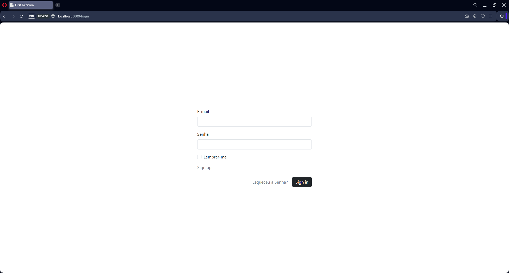

### Tela de Login com Credenciais Inválidas.
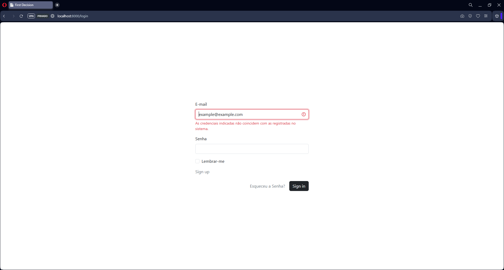

### Tela de Produtos
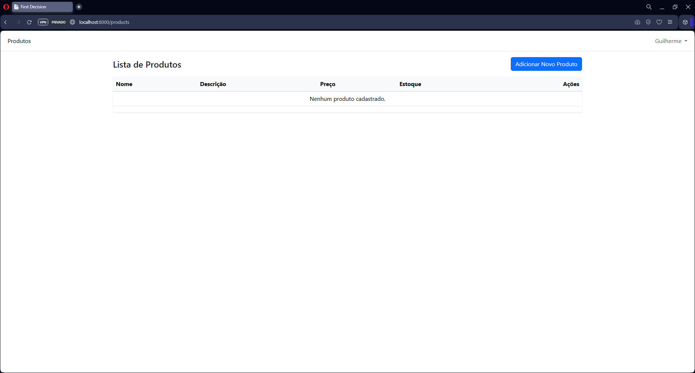

### Demonstração do CRUD
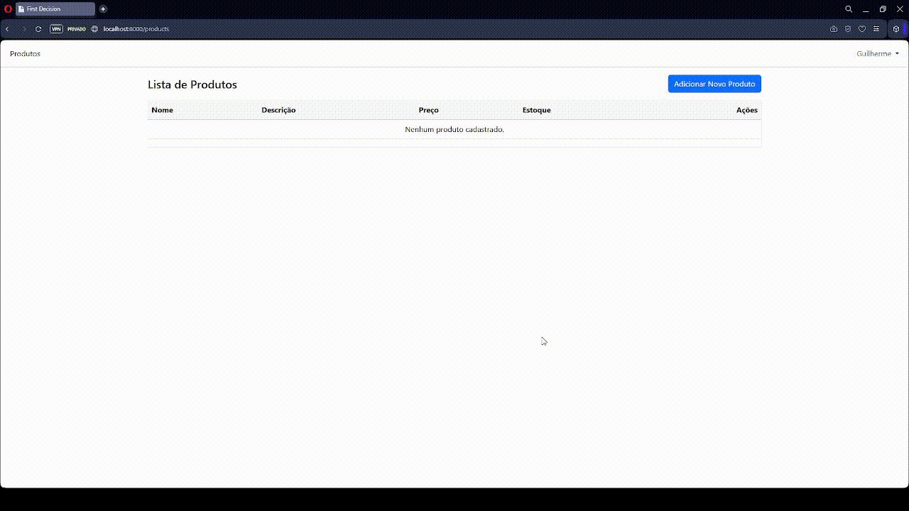

## 🖼️ Screenshots das Rotas da API

### Rota de Registro de Usuário
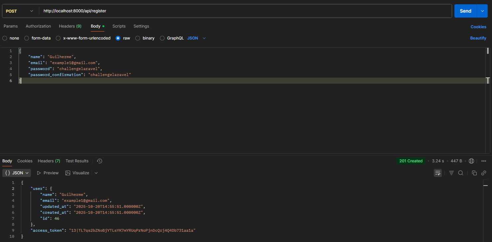

### Rota de Login
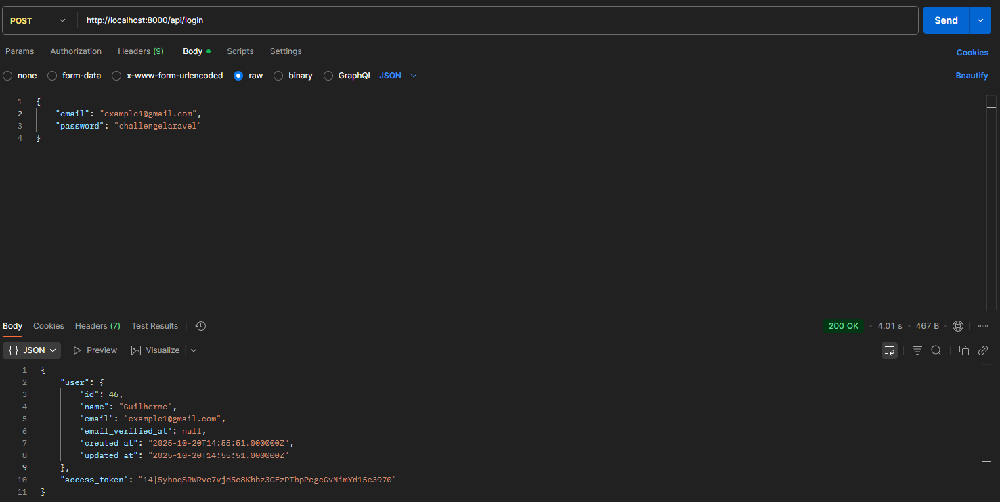

### Rota de Listagem de Produtos
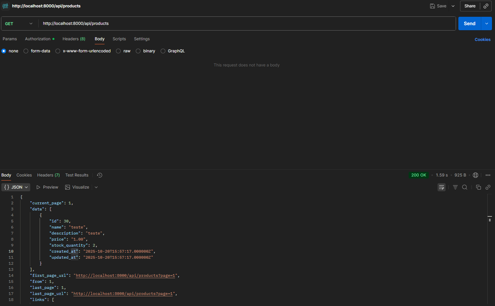

### Rota de Cadastrar Produto
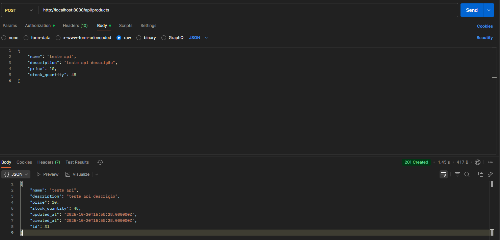

### Rota de Buscar Produto
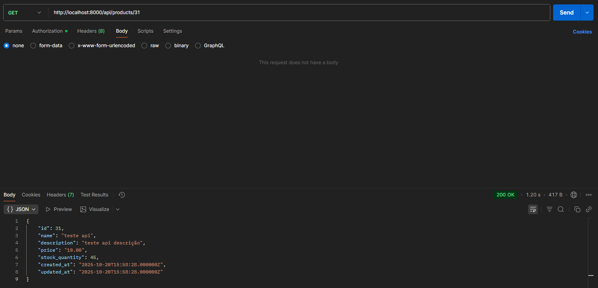

### Rota de Atualizar Produto
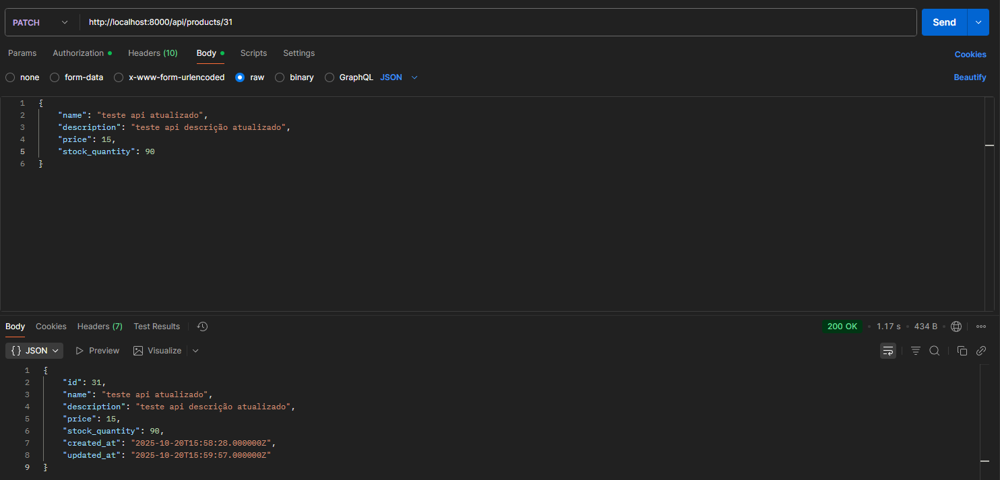

### Rota de Deletar Produto
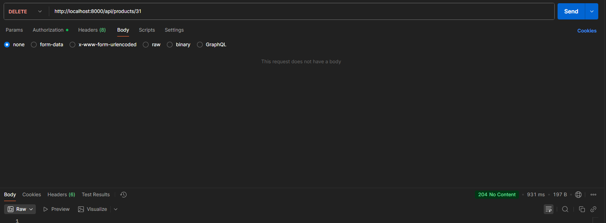